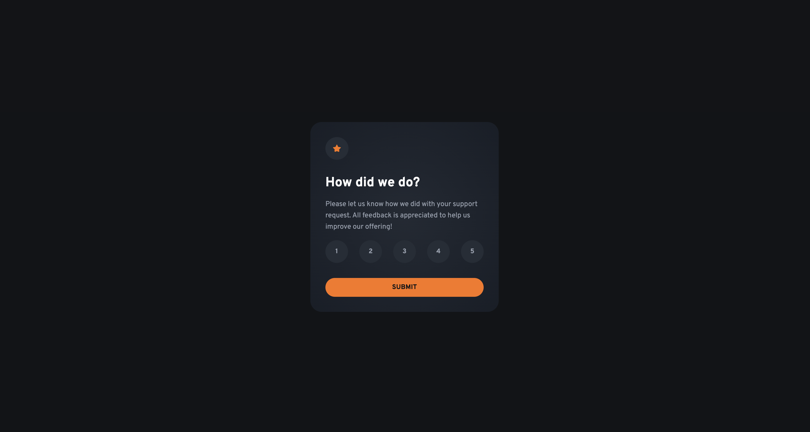

# Frontend Mentor - Interactive rating component solution

This is a solution to the [Interactive rating component challenge on Frontend Mentor](https://www.frontendmentor.io/challenges/interactive-rating-component-koxpeBUmI). Frontend Mentor challenges help you improve your coding skills by building realistic projects. 

## Table of contents

- [Overview](#overview)
  - [The challenge](#the-challenge)
  - [Screenshot](#screenshot)
  - [Links](#links)
- [My process](#my-process)
  - [Built with](#built-with)
  - [What I learned](#what-i-learned)
- [Author](#author)

## Overview

### The challenge

Users should be able to:

- View the optimal layout for the app depending on their device's screen size
- See hover states for all interactive elements on the page
- Select and submit a number rating
- See the "Thank you" card state after submitting a rating

### Screenshot

### Links

- Solution URL: [https://github.com/hackz101/interactive-rating-component-main](https://github.com/hackz101/interactive-rating-component-main)
- Live Site URL: [https://interactive-rating-component-main-lac.vercel.app/](https://interactive-rating-component-main-lac.vercel.app/)

## My process

### Built with

- Semantic HTML5 markup
- CSS custom properties
- CSS Grid
- Responsive Design
- [Normalize.css](https://necolas.github.io/normalize.css//) - For CSS resets

### What I learned

In this challenge I learned that sometimes when destroying elements and inserting HTML, there will be a flicker due to the delay and parent resizing. To fix this I put both sections on the page and hid one at a time using display none.

I also learned that sometimes mobile reacts really weirdly to focus, hover etc. Even if you just click a button on mobile, there maybe be a hover state that was added.

## Author

- Frontend Mentor - [@hackz101](https://www.frontendmentor.io/profile/hackz101)